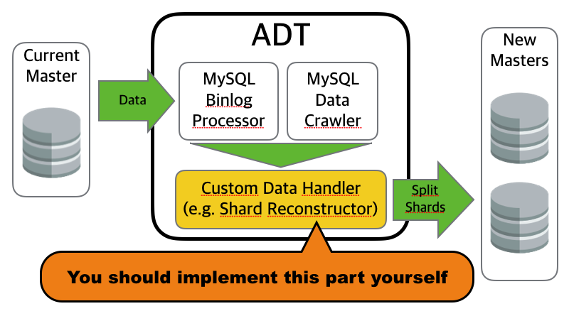
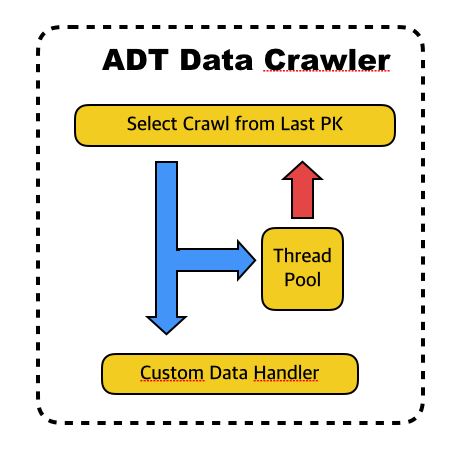
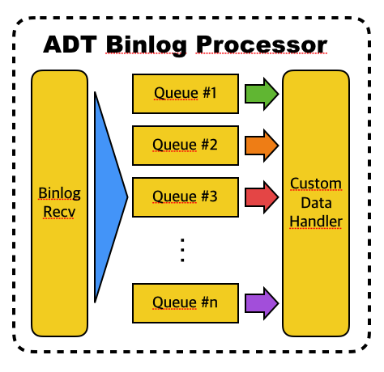

# ADT

## About ADT

`A` Almighty <br/>
`D` Data <br/>
`T` Transmitter <br/>

**MySQL의 실시간으로 변경되는 데이터**를 가져와서 가공 후 다른 저장소에 저장할 목적으로 만든 툴입니다.
사용하기에 따라 일회성 용도로 사용할 수도 있고, 무중단 실시간 마이그레이션 용도로 사용할 수도 있습니다.

Using ADT, You can receive **all real time changes of MySQL**, transform the received data, and load to other data storage.
Depending on the use, it is not only for a one-time use, also can be used as live migration purposes.

---------------------------------------------------------

## 사용 예시 (Examples of Usage)

- MySQL 샤딩 룰 변경 혹은 재구성
  - Modulus 샤딩 환경에서 신규 DB 추가
  - 샤딩 룰 변경 (예: modulus <--> range)
  - 사용자 ID 기준으로 나눠진 샤드를 GPS 좌표 기준으로 실시간 MySQL 샤딩 재구성  
- MySQL에서 NoSQL을 포함한 다른 DB, 다른 스키마의 테이블로 실시간 복사
- 데이터 변경을 감지하여, 적절한 사용자에게 비동기로 Push 알림 전송

###### In English,
- Change rule of, or reconstruct MySQL shards
  - Add new DB in modulus-sharded environment
  - Change shard rule (e.g. Modulus <--> Range)
  - Reconstruct MySQL shards from user ID based to GPS point based in real time
- Copy from MySQL to other different table, DB, or NoSQL in real time
- By detecting real time changes, send push-noti asynchronously.

---------------------------------------------------------

## 특징 (Features)

### Custom Data Handler

- 수집한 데이터를 변환, 적재 등을 하는 메소드
- **사용자가 직접 구현해야 함**
- **processData** 메소드는 여러 스레드에 의해 동시에 호출될 수 있으므로 **thread-safe** 고려 필요
- 예시의 그림의 handler는 한 서버에서 2개의 샤드로 분리하는 일을 수행함

###### In English,

- Methods that handle collected data
- **You should implement your own data handler**
- you should consider **thread-safe** when implement methods, because the method named **processData** may be invoked by multiple threads.
- In the picture below, the example handler split into 2 shards.

```java
// Please see com.kakao.adt.handler package
void processData(MysqlBinlogData data) throws Exception;
void processData(MysqlCrawlData data) throws Exception;
```



### Table Crawler

- 설정한 테이블에서 primary key 순서대로 데이터를 수집
- 수집한 데이터는 사용자가 구현한 Data Handler로 전달
- Pipelined Execution
  - Data Handler 호출 전, 다른 스레드가 다음 `SELECT` 실행하도록 함
  - `SELECT`는 primary key 순서대로 일어나지만, Handler 호출은 `SELECT` 순서를 보장하지 않음

###### In English,
- Execute `SELECT` query in primary key order
- Selected data is passed to data handler that you implemented
- Pipelined Execution
  - Between invoking `SELECT` query and your data handler, another thread `SELECT` next data.
  - Though `SELECT` is executed in order, data handler is NOT invoked in order.

```sql
# Loop of this query
SELECT * FROM ? [ WHERE id > ? ] LIMIT ? [ FOR UPDATE ]
```




### Binary Log Receiver

- MySQL Replication Protocol을 이용해 Binary Log(row format) 수집
- 수집한 데이터는 사용자가 구현한 Data Handler로 전달
- 병렬 처리
  - 그림을 보면, enqueue는 하나의 스레드가 하지만, dequeue는 각 queue를 담당하는 스레드가 실행
  - 같은 queue에 있으면 PK 혹은 UK 값이 겹쳐서 서로 연관이 있는 이벤트임
  - PK나 UK 값이 겹치는 row들은 순차적으로 처리
  - 연관성이 없는 row 간에는 병렬로 처리

###### In English,
- Receive binary logs(row format) using MySQL Replication Protocol
- Selected data is passed to data handler that you implemented
- Parallel Execution
  - In picture, events are enqueued by a single thread, but dequeued by multiple threads.
  - Only one thread for a queue
  - If same queue, then it means events should be processed sequentially.
  - In other words, if values of unique key(include primary key) are the same between two row events, then the events are passed to your handler sequentially.
  - Otherwise, events are passed to the handler in parallel.



---------------------------------------------------------

## 요구 사항 (Requirements)

- MySQL binary log는 `row` format (full)만 지원 (`mixed`, `statement` 방식 불가)
- 모든 table들은 primary key가 있어야 함
- Data handler 관련해서,
  - `ADT`는 데이터 수집 및 handler 병렬 호출만 하므로 반드시 구현해야 함.
  - Thread-safe 고려 필요
  - 에러 및 배포 시 재시작할 경우에 대해 대비 필요('에러 처리' 참고)
- `ALTER TABLE` 같은 DDL 이벤트 처리 불가
- `datetime` 타입에서 millisecond 파싱 불가
- 기타 궁금하신 점은 이슈 트래커를 통해 질문해주세요.

###### In English,
- MySQL binary log format should be full(not minimal) `row` format. `mixed` or `statement` are unsupported.
- All table should have primary key index.
- About data handler,
  - You must implement your own data handler, because `ADT` just receive/collect data, and invoke data handler.
  - You should consider thread-safe.
  - `ADT` can be restart caused by error or your deployment. (See 'How to Handle Error')
- Can't handle DDL like `ALTER TABLE`
- Can't parse millisecond of `datetime` type
- If you have any question, please ask through the issue tracker.

---------------------------------------------------------

## 에러 처리 방법(How to Handle Errors)

> Binary Log Receiver에만 해당하는 이야기 입니다.

1. Error 감지 --> `ADT` 자동 종료
2. 가장 마지막 처리 완료한 binlog file부터 재시작
3. 이미 처리한 row event는 overwrite 혹은 skip
4. 처리한 적이 없는 데이터일 경우는 기본적인 방법으로 처리


- `ADT`는 에러 발생 시, 자동으로 종료됨
- 데이터 정합성을 위해 가장 마지막으로 처리가 완료된 binary log file부터 재시작하는 것을 권장함
  - 병렬 처리 특성 상 row event는 순차적으로 처리되지 않음
  - 따라서, 데이터 누락을 막기 위해서는 재시작 시 이미 처리했던 데이터를 다시 처리해야하는 경우가 발생함
  - 예제로 포함된 **adt-handler-mysql-shard-rebalancer**의 경우, 항상 overwrite 하도록 구현되어 있음

###### In English,

> This chapter is only for Binary Log Receiver.

1. Error Detection --> `ADT` may shut down
2. Restart from the last complete binlog file
3. If a event is that already processed, then overwrite or skip
4. Otherwise, just process normally.


- `ADT` may shut down when any error occurs.
- For data integrity, it is recommended that restarting from last complete binlog file.
  - All row events are not processed in sequential.
  - So, for data integrity, `ADT` may process some row events twice when restart.
  - To solve this problem, **adt-handler-mysql-shard-rebalancer**, an example handler, always overwrite data.

---------------------------------------------------------

## 사용 방법 (How to Use ADT)

### Custom Handler 구현 (Implement Your Custom Handler)

1. Maven 프로젝트 생성
2. pom.xml을 열어서 **adt-handler-parent** 프로젝트 상속받도록 설정
3. Handler 구현
  - Binlog 수집을 하려면 **MysqlBinlogProcessorHandler** 인터페이스 구현
  - Table 크롤링을 하려면 **MysqlCrawlProcessorHandler** 인터페이스 구현

> 자세한 구현은 **adt-handler-mysql-shard-rebalancer** 프로젝트를 참고하세요.

###### In English,

1. Create new Maven project
2. Open pom.xml file, and inherit **adt-handler-parent**
3. Implement handler(s)
  - Implement **MysqlBinlogProcessorHandler** interface if you want to handle binary logs
  - Implement **MysqlCrawlProcessorHandler** interface if you want to use table crawler

> Refer to **adt-handler-mysql-shard-rebalancer**

```xml
<!-- adt-handler-parent 상속 -->
<!-- inherit adt-handler-parent -->

<!-- pom.xml -->
<project ...>
    <modelVersion>4.0.0</modelVersion>
    <parent>
        <groupId>com.kakao.adt</groupId>
        <artifactId>adt-handler-parent</artifactId>
        <version>${adt-current-version}</version>
    </parent>
    <artifactId>adt-handler-foo-bar</artifactId>
    <name>This is an example custom handler</name>
</project>
```

### 빌드하기 (Build)

1. ADT 빌드: ADT가 아직 Maven Repository에 없으므로 로컬에 직접 빌드를 해야함
2. Handler 빌드
3. 빌드 결과물 확인

###### In English,
1. Build ADT: ADT doesn't exist in Maven Repository yet, so you should build yourelf.
2. Build your own handler
3. Check your build results

```sh
# 1. Build ADT

cd $ADT_HOME
mvn install -DskipTests=true
```

```sh
# 2. Build Handler

cd $HANDLER_HOME
mvn package
```

```sh
# 3. Check outputs

cd $HANDLER_HOME/target/jar
ls -1
```
```
adt-handler-foo-bar-0.0.1-SNAPSHOT.jar
adt-worker-0.0.1-SNAPSHOT.jar
commons-dbcp2-2.1.1.jar
commons-logging-1.2.jar
commons-pool2-2.4.2.jar
jackson-annotations-2.6.0.jar
jackson-core-2.6.5.jar
jackson-databind-2.6.5.jar
jts-1.13.jar
logback-classic-1.1.6.jar
logback-core-1.1.6.jar
mysql-connector-java-5.1.38.jar
open-replicator-1.4.2.jar
slf4j-api-1.7.19.jar
```

### 실행하기 (Execution)

1. Classpath 설정
2. Worker type 지정
  - **com.kakao.adt.WorkerMain**에 있는 **WorkerType** enum 참조
3. ADT 설정 파일 위치 지정
  - 파일위치는 JVM 기본 System Property인 **user.dir** 기준으로 지정
  - 설정파일은 JSON으로 작성
  - ADT 실행 시 JSON 파일은 설정 클래스 객체로 변환됨
  - **MysqlBinlogProcessorConfig** / **MysqlCrawlProcessorConfig** 참조
4. 실행할 클래스 설정: **com.kakao.adt.WorkerMain**
5. 실행

###### In English,
1. Set classpath
2. Set worker type
  - See **WorkerType** in **com.kakao.adt.WorkerMain**
3. Set ADT config file path
  - File location is relative on the basis of a JVM default system property,**user.dir**.
  - Config files should be written in JSON format.
  - When ADT start up, your JSON file is deserialized into a config object.
  - See **MysqlBinlogProcessorConfig** / **MysqlCrawlProcessorConfig**
4. Set main class: **com.kakao.adt.WorkerMain**
5. Run

```sh
java -cp `echo lib/*.jar | tr ' ' ':'` \
-Dcom.kakao.adt.worker.type=MysqlBinlogReceiver \
-Dcom.kakao.adt.worker.configFilePath=foo_bar_config.json \
com.kakao.adt.WorkerMain
```

---------------------------------------------------------

## ADT 테스트 (Test ADT)

> 작성한 Handler에 대한 테스트가 아닌, ADT를 고쳤을 때의 테스트 입니다.<br/>
> This chapter is about how to test ADT when you modified ADT,
> not for your custom handler

### Unit Test

#### 요구 사항 (Requirements)
- MySQL Server(s)
  - Port 3306
  - Global Variable `log-bin=ON`
  - Global Variable `binlog_format=row`
  - Account
    - username: `adt`
    - password: `adt`
- Add custom domains in **/etc/hosts**
  - [your mysql ip] adt-test-my001.example.com
  - [your mysql ip] adt-test-my002.example.com
  - [your mysql ip] adt-test-my003.example.com

#### Run Test

```sh
cd $ADT_HOME
mvn test
```

### System Integrated Test

> 통합 테스트는 **adt-handler-mysql-shard-rebalancer**를 사용합니다.<br/>
> Integrated test uses **adt-handler-mysql-shard-rebalancer**.

1. Go to directory **adt-test/msr_test_script**
```sh
cd $ADT_HOME/adt-test/msr_test_script
```

2. Copy **server_list_template.sh** as **server_list.sh**, and edit
```sh
cp server_list_template.sh server_list.sh
vi server_list.sh
```

3. Copy **msr_binlog_test_config_template.json** as **msr_binlog_test_config.json**, and edit
```sh
cp msr_binlog_test_config_template.json msr_binlog_test_config.json
vi msr_binlog_test_config.json
```

4. Deployment
```sh
./deploy_system_test.sh
```

5. Reset Database Status
```sh
# Reset binary logs & create tables
./reset_db_adt_test.sh
```

6. Execute many DML queries
```sh
./startup_dml_query_tool.sh
```

7. Run ADT
```sh
./startup_adt_binlog_processor.sh
```

8. Check data integrity
```sh
./startup_data_integrity_checker.sh
```

9. (Optional) Shutdown Master DB
```sh
./startup_src_db_trouble_maker.sh
```
  - After this, ADT may shut down.
  - Then, restart it from the last complete binlog file.

---------------------------------------------------------

## Example Handler: MySQL Shard Rebalance Handler

- DB 샤드 분배하기 위한 목적으로 만든 handler
- 제대로 사용하기 위해서는 **AbstractMysqlHandler** 클래스의 **getShardIndex** 메소드 수정 필요
- 사용 시 발생할 수 있는 문제에 대한 책임은 사용자에게 있습니다.

###### In English,
- Using this handler, you can make your DB split into multiple shards.
- If you want to use this handler, modify **getShardIndex** method in **AbstractMysqlHandler** class.
- It's your responsibility for problems that can be occurred when using.


---------------------------------------------------------

## 병렬 처리와 데이터 정합성 <br/> (Parallel Execution & Data Integrity)

> Binary Log Receiver에만 해당하는 이야기 입니다.

보통 관계형 데이터베이스에서 integrity constraint를 크게 네 가지로 분류할 수 있습니다.
([wikipedia - Data Integrity](https://en.wikipedia.org/wiki/Data_integrity#Types_of_integrity_constraints))
- Domain Integrity: 컬럼 타입, NOT NULL, CHECK, ...
- Entity Integrity: primary key, unique key
- Referential Integrity: foreign key
- User-defined Integrity: (고려 안 함)

우선, domain integrity는 고려하지 않습니다.
Binlog에 저장된 데이터 그 자체가 이미 domain integrity를 만족하고 있기 때문입니다.
다른 데이터의 존재 유무에 따라 DML 결과가 달라지는 constraint에 대해서만 순차적으로 실행하면 정합성을 보장한다고 판단합니다.

그렇다면 다른 row의 존재 유무에 따라 영향을 받는 constriant는 MySQL 기준, 다음 항목들이 있습니다.

- unique key (primary 포함)
- foreign key

그러나 외래키도 고려 대상이 아닙니다.
왜냐면 binlog에 기록된 데이터 자체가 이미 외래키의 constraint를 만족한다는 뜻이고,
외래키로 인해 자동으로 변경되는 데이터도 binlog에 기록이 되기 때문입니다.
적재할 DB에 **SET FOREIGN_KEY_CHECKS = 0;**으로 설정 후 값을 넣으면
순간적으로 FK constraint가 깨질 수도 있지만, 최종적으로는 binlog의 모든 데이터를 복사하게 되므로
결국 데이터의 정합성을 보장할 것이라 판단했기 때문입니다.

최종적으로 PK, UK만 남게 되고, 두 종류의 인덱스 값이 일치하는 binlog event들 간에만 순차 실행을 보장합니다.

###### In English,

> This chapter is only for Binary Log Receiver.

Usually, relational database has 4 integrity constraints.

- Domain Integrity: column type, NOT NULL, CHECK, ...
- Entity Integrity: primary key, unique key
- Referential Integrity: foreign key
- User-defined Integrity: (not considered)

First, domain integrity is not our concern.
All data in row events are already satisfied this integrity.
So, we consider only entity & referential integrities; Results of DMLs can be different caused by these integrity.

MySQL has three entity/referential integrities.

- unique key (include primary)
- foreign key

However, FK is not considered, neither.
Data in binlog means that it satisfies FK, and changed data caused by FK may exist in binlog, too.
When you load data to your target database (with **SET FOREIGN_KEY_CHECKS = 0;**),
FK constraint may be broken for a moment.
But, finally all data will be loaded include automatically changed data,
and data integrity problem will be solved.

So, we consider only two constraints: primary key and unique key.
